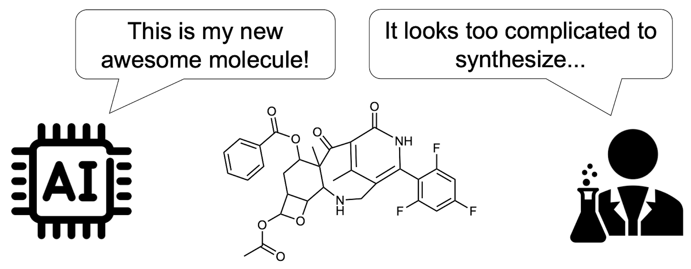

# RxnFlow: Generative Flows on Synthetic Pathway for Drug Design

[](https://www.python.org/downloads/)
[](LICENSE)



Official implementation of RxnFlow, a generative model for synthesis-aware drug design. [[Paper](https://arxiv.org/abs/2410.04542)]
The model is trained using a generative flow network (GFlowNet) framework, yielding a diverse set of high-reward molecules.

- 2026.10.03: We updated this codebase based on our in-house model **Hyper Screening X (HSX)**, developed in collaboration with [HITS](https://hits.ai/index_en.html) and [eMolecules](https://www.emolecules.com/). The preprint is coming soon. The original ICLR 2025 version is still available in the `iclr2025` branch.

## Installation

RxnFlow requires Python 3.10 or later.

```bash
git clone https://github.com/SeonghwanSeo/RxnFlow
cd RxnFlow/
pip install -e .
```

## Prepare a synthesis environment

To construct a synthesis environment, you need a building-block library and reaction templates. The default set in `data/templates/basic/` includes 38 bimolecular reaction templates and 4 unimolecular transformations.

Prepare a building-block library, for example from [eMolecules](https://www.emolecules.com/data-downloads) or [Enamine](https://enamine.net/building-blocks/building-blocks-catalog), as a `.smi` file with one `SMILES<TAB>ID` record per line. Then run the following command to prepare the environment using the default templates.

Example command with 5k ZINC building blocks:
```bash
python scripts/prepare.py \
  --building-blocks ./data/building_blocks/example_5k.smi \
  --env-dir ./data/envs/example_5k/ \
  --config ./data/templates/basic/config.yaml \
  --num-workers 16
```

Set `data.env_dir` in your training configuration to the prepared directory. See [environment preparation](docs/environment.md) for more details.

## Single-objective optimization

Train with QED as the reward:

```bash
python examples/qed.py --config configs/qed.yaml --steps 1000 --output-dir runs/qed
```

See [define your own reward](docs/rewards.md) and [training](docs/training.md) for more details on training and reward configuration.

## Multi-objective optimization

Train on QED and SA score:

```bash
python examples/qed_sa.py --config configs/qed_sa.yaml --steps 3000 --output-dir runs/qed_sa
```

This example jointly optimizes QED and SA score with temperature and preference conditioning. See [multi-objective optimization](docs/rewards.md#combine-multiple-objectives) for details.

## Sampling

Generate molecules and their synthesis routes from a trained checkpoint:

```bash
python scripts/sample.py \
  --checkpoint runs/qed_sa/checkpoints/latest.ckpt \
  --num-samples 100 \
  --output samples.csv
```

See [sampling](docs/training.md#sampling) for more details on sampling.

## Citation

If you use this code in your research, please cite the following paper:

```bibtex
@article{seo2024generative,
  title={Generative Flows on Synthetic Pathway for Drug Design},
  author={Seo, Seonghwan and Kim, Minsu and Shen, Tony and Ester, Martin and Park, Jinkyoo and Ahn, Sungsoo and Kim, Woo Youn},
  journal={arXiv preprint arXiv:2410.04542},
  year={2024}
}
```
